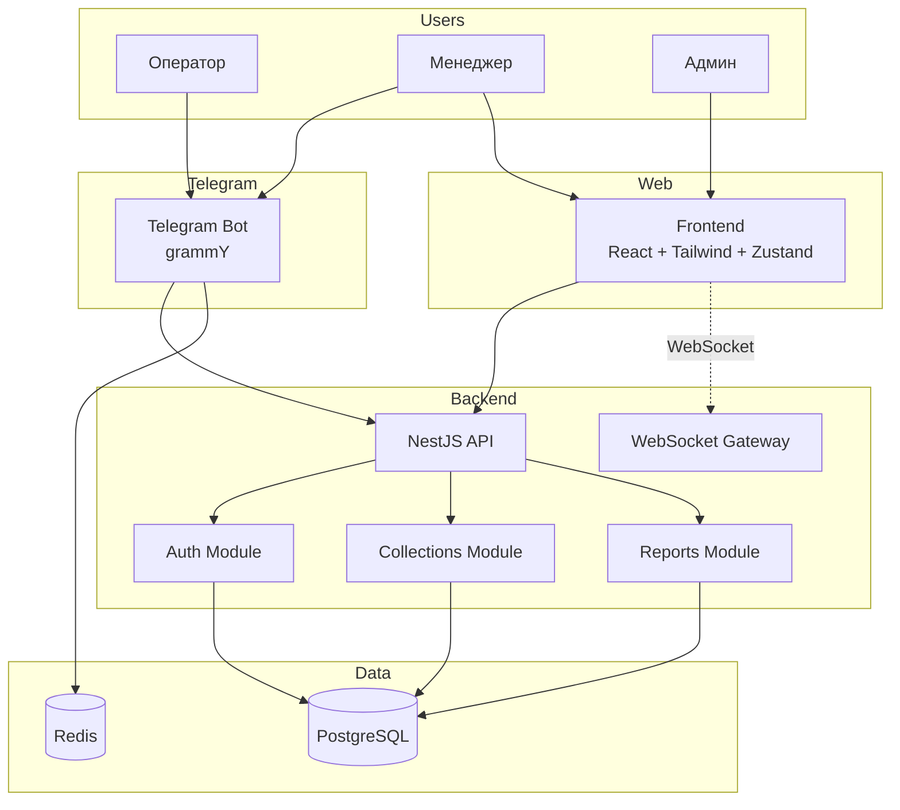
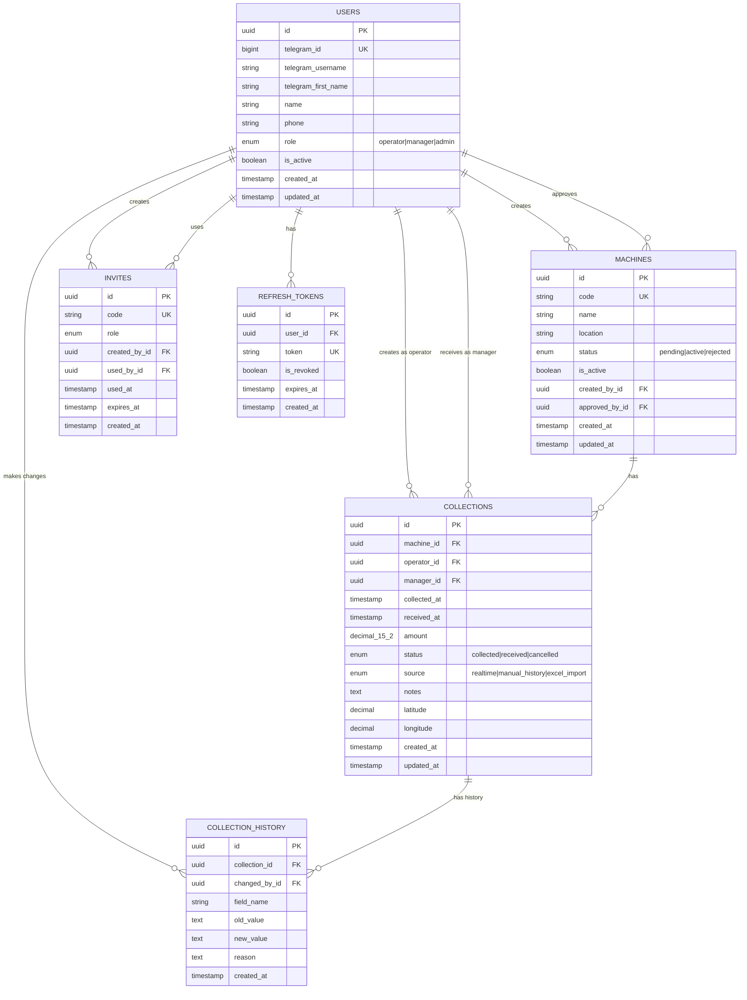
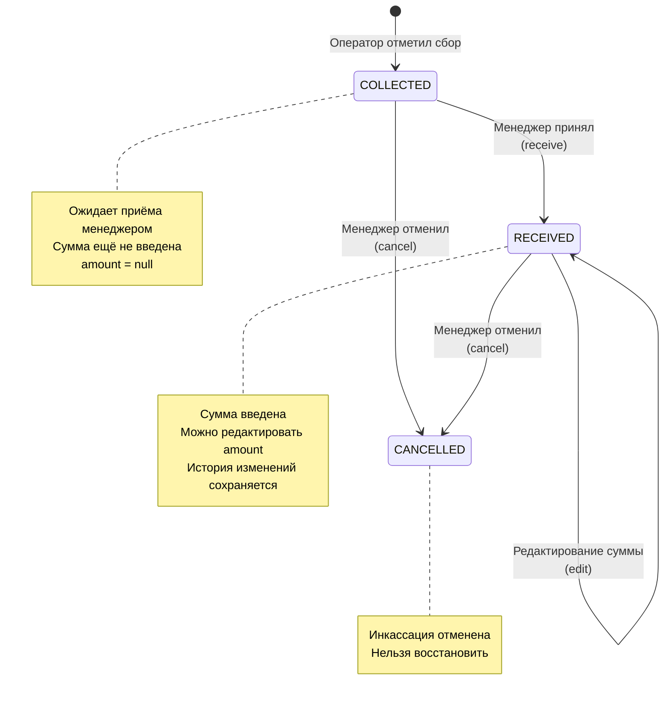

# Аудит VendCashBot

**Дата:** 2026-01-25
**Commit:** 98dfe06ff693939c328281bac2c071eeebb5ab2c
**Аудитор:** Claude (автоматизированный анализ)
**Время анализа:** ~4 часа

---

## Executive Summary

| Метрика | Значение | Норма | Статус |
|---------|----------|-------|--------|
| Общая оценка | 7/10 | ≥7 | 🟢 |
| Security | 6/10 | ≥8 | 🟡 |
| Data Integrity | 8/10 | ≥9 | 🟡 |
| Test Coverage | ~60% | ≥70% | 🟡 |
| Audit Logging | Частично | Да | 🟡 |
| Backup | Не настроен | Да | 🔴 |

**Готовность к production:** С оговорками
**Критических блокеров:** 2
**High issues:** 5

### Ключевые достоинства
- ✅ DECIMAL(15,2) для финансовых сумм
- ✅ Pessimistic locking для receive/edit/cancel
- ✅ Проверка Telegram auth hash
- ✅ Rate limiting на API
- ✅ Excel formula injection защита
- ✅ Database trigger для иммутабельности audit log

### Главные проблемы
- 🔴 Exposed Telegram bot token в .env
- 🔴 Операция receive() не логируется в audit
- 🟠 JWT хранится в localStorage (XSS риск)
- 🟠 Нет rate limiting на Telegram команды
- 🟠 Уведомления менеджерам не реализованы

---

## Findings

### 🔴 Critical (блокеры, исправить до релиза)

| # | Категория | Проблема | Файл:строка | Решение | Effort |
|---|-----------|----------|-------------|---------|--------|
| 1 | Security | **Exposed Telegram Bot Token** - реальный токен в .env файле в репозитории | `.env:14`, `backend/.env:19` | Немедленно revoke токен через @BotFather, удалить .env из истории git, использовать environment variables | 2h |
| 2 | Audit | **receive() не логируется** - ключевая финансовая операция (ввод суммы) не создаёт audit record | `collections.service.ts:233-270` | Добавить CollectionHistory запись при receive() аналогично edit() | 2h |

### 🟠 High (исправить в Sprint 1)

| # | Категория | Проблема | Файл:строка | Решение | Effort |
|---|-----------|----------|-------------|---------|--------|
| 3 | Security | **Weak JWT Secret validation** - нет проверки минимальной длины (32 символа) | `configuration.ts:54` | Добавить валидацию `if (jwtSecret.length < 32) throw Error()` | 1h |
| 4 | Security | **JWT в localStorage** - уязвимо к XSS атакам | `frontend/AuthContext.ts:persist` | Перейти на httpOnly cookies | 4h |
| 5 | Telegram | **Нет rate limiting на команды бота** | `telegram.service.ts` | Добавить Grammy ratelimiter middleware | 2h |
| 6 | Notifications | **Менеджеры не получают уведомления о новых инкассациях** | `telegram.service.ts`, `collections.service.ts` | Интегрировать NotificationsGateway и добавить Telegram уведомления | 4h |
| 7 | Dependencies | **Vulnerable xlsx library** - prototype pollution, ReDoS | `frontend/package.json` | Заменить на exceljs или ограничить размер файлов | 4h |

### 🟡 Medium (исправить в Sprint 2)

| # | Категория | Проблема | Файл:строка | Решение | Effort |
|---|-----------|----------|-------------|---------|--------|
| 8 | Data | **TypeScript number для DECIMAL** - возможна потеря точности при parseFloat | `collection.entity.ts:58`, `reports.service.ts:97` | Использовать string или decimal.js | 4h |
| 9 | Concurrency | **Race condition в create()** - duplicate check не атомарен | `collections.service.ts:61-87` | Добавить транзакцию или unique constraint | 2h |
| 10 | Validation | **Нет @Max для EditCollectionDto.amount** | `edit-collection.dto.ts:6-8` | Добавить `@Max(1000000000)` | 30m |
| 11 | Security | **Health endpoint раскрывает детали системы** | `health.controller.ts:28-36` | Ограничить доступ к детальным метрикам | 1h |
| 12 | IDOR | **GET /collections/:id доступен всем ролям** | `collections.controller.ts:52-56` | Добавить проверку владельца для операторов | 2h |
| 13 | Frontend | **Нет Error Boundaries** | `frontend/src/` | Добавить React ErrorBoundary компонент | 2h |
| 14 | DevOps | **Backend Dockerfile отсутствует** | `docker-compose.yml` references missing file | Создать Dockerfile для backend | 2h |
| 15 | Audit | **request_id не сохраняется в audit** | `collection-history.entity.ts` | Добавить поле request_id для трассировки | 2h |

### 🟢 Low (backlog)

| # | Категория | Проблема | Файл:строка | Решение | Effort |
|---|-----------|----------|-------------|---------|--------|
| 16 | DevOps | **Нет .dockerignore** | root, backend/, frontend/ | Создать .dockerignore файлы | 30m |
| 17 | DevOps | **Non-root user не используется в Docker** | Dockerfiles | Добавить USER instruction | 1h |
| 18 | Testing | **RBAC тесты замоканы** - guards всегда возвращают true | `test/*.e2e-spec.ts` | Добавить интеграционные тесты с реальными guards | 8h |
| 19 | Audit | **TRUNCATE не защищён** | `1737700000000-ProtectAuditLog.ts` | Добавить trigger на TRUNCATE или REVOKE | 1h |
| 20 | Session | **In-memory session storage в dev** | `telegram/session-storage.ts` | Требовать Redis в production | 1h |
| 21 | Seed | **synchronize: true в seed.ts** | `seed.ts:14` | Изменить на false, использовать миграции | 30m |
| 22 | Dependencies | **Backend npm audit warnings** - glob, lodash, js-yaml, tmp | `backend/package.json` | Обновить зависимости | 2h |

**Effort шкала:** 30m, 1h, 2h, 4h, 8h (1d), 16h (2d), 40h (1w)

---

## Action Plan

### 🚨 Sprint 0 (до релиза) - КРИТИЧЕСКИЕ БЛОКЕРЫ

```
[ ] #1: НЕМЕДЛЕННО - Revoke Telegram bot token
    1. Открыть @BotFather в Telegram
    2. /revoke для текущего токена
    3. Получить новый токен
    4. Удалить .env из git history: git filter-branch или BFG Repo-Cleaner
    5. Настроить Railway environment variables

[ ] #2: Добавить audit logging для receive()
    Файл: backend/src/modules/collections/collections.service.ts
    В методе receive() после строки 254 добавить:

    const history = queryRunner.manager.create(CollectionHistory, {
      collectionId: id,
      changedById: managerId,
      fieldName: 'amount',
      oldValue: null,
      newValue: dto.amount.toString(),
      reason: 'Initial receive',
    });
    await queryRunner.manager.save(history);
```

### Sprint 1 (неделя 1)

```
[ ] #3: JWT secret length validation
[ ] #4: Migrate JWT to httpOnly cookies (или документировать риск)
[ ] #5: Add Telegram bot rate limiting
[ ] #6: Integrate NotificationsGateway + Telegram notifications
[ ] #7: Replace xlsx with exceljs or add input validation
[ ] #10: Add @Max validation to EditCollectionDto
```

### Sprint 2 (неделя 2-3)

```
[ ] #8: Use string/decimal.js for amounts
[ ] #9: Add transaction to create() for atomic duplicate check
[ ] #11: Restrict health endpoint details
[ ] #12: Add ownership check for operators in GET /collections/:id
[ ] #13: Add React Error Boundaries
[ ] #14: Create backend Dockerfile
[ ] #15: Add request_id to collection_history
```

### Backlog

```
[ ] #16-22: Low priority items
[ ] Backup strategy implementation
[ ] Staging environment setup
[ ] Test coverage improvement to 70%+
```

---

## OWASP Top 10 Checklist

| # | Уязвимость | Статус | Примечания |
|---|------------|--------|------------|
| A01 | Broken Access Control | 🟡 | RBAC есть, но IDOR на GET /collections/:id |
| A02 | Cryptographic Failures | 🟡 | JWT secret может быть слабым |
| A03 | Injection | 🟢 | Параметризованные запросы, whitelist сортировки |
| A04 | Insecure Design | 🟡 | receive() не логируется |
| A05 | Security Misconfiguration | 🟡 | Health endpoint раскрывает детали |
| A06 | Vulnerable Components | 🟠 | xlsx library, несколько moderate vulns |
| A07 | Auth Failures | 🟢 | Telegram auth проверяется, JWT корректен |
| A08 | Data Integrity Failures | 🟡 | Audit неполный для receive() |
| A09 | Logging Failures | 🟡 | Structured logs есть, но audit неполный |
| A10 | SSRF | 🟢 | Нет уязвимых паттернов |

---

## Диаграммы

### A: Архитектура системы



### B: ERD схема



### C: State diagram инкассации



### D: Telegram Bot Flow

```mermaid
flowchart TB
    START[/start] --> CHECK{Зарегистрирован?}
    CHECK -->|Нет + invite code| REGISTER[Регистрация с ролью]
    CHECK -->|Нет| WELCOME[Показать welcome screen]
    CHECK -->|Да| MENU[Показать меню по роли]

    subgraph "Оператор"
        OP_COLLECT[Отметить сбор] --> SELECT_MACHINE[Выбор автомата]
        SELECT_MACHINE --> CONFIRM_COLLECT[Подтверждение]
        CONFIRM_COLLECT --> SEND_TO_MANAGER[Уведомить менеджера]
    end

    subgraph "Менеджер"
        MG_PENDING[Ожидающие] --> VIEW_COLLECTION[Просмотр инкассации]
        VIEW_COLLECTION --> RECEIVE[Принять + ввести сумму]
        VIEW_COLLECTION --> CANCEL[Отменить]
    end

    subgraph "Админ"
        AD_MACHINES[Управление автоматами]
        AD_USERS[Управление пользователями]
        AD_INVITES[Приглашения]
    end

    MENU --> OP_COLLECT
    MENU --> MG_PENDING
    MENU --> AD_MACHINES
    MENU --> AD_USERS
    MENU --> AD_INVITES
```

---

## Positive Findings (что сделано хорошо)

### Security
- ✅ **Helmet.js** настроен с CSP (main.ts:23-35)
- ✅ **Rate limiting** с тремя уровнями: short/medium/long (app.module.ts:29-45)
- ✅ **Telegram auth verification** с HMAC (auth.service.ts:75-99)
- ✅ **Refresh token rotation** - старые токены revoke (auth.service.ts:136-157)
- ✅ **Admin role creation prevented** - нельзя создать invite для admin (invites.service.ts:23-25)
- ✅ **Excel formula injection protection** (reports.controller.ts:16-26)
- ✅ **Sort field whitelisting** предотвращает SQL injection (collections.service.ts:195-196)

### Data Integrity
- ✅ **DECIMAL(15,2)** для денег вместо FLOAT (collection.entity.ts:57)
- ✅ **Pessimistic locking** на receive/edit/cancel (collections.service.ts:242)
- ✅ **Transactions** для multi-step операций
- ✅ **Database trigger** для иммутабельности audit log (migration)
- ✅ **UUID validation** на всех ID полях
- ✅ **Duplicate prevention** с configurable time window

### Architecture
- ✅ **TypeScript strict mode** в backend и frontend
- ✅ **Graceful shutdown** с SIGTERM/SIGINT обработкой
- ✅ **Health checks** с database, memory проверками
- ✅ **Structured JSON logs** в production
- ✅ **Zustand + React Query** - современный state management

---

## Финальный чеклист

### 🔴 Security (блокеры)
- [ ] JWT секрет ≥ 32 символа — **НЕ ПРОВЕРЯЕТСЯ**
- [x] Telegram auth hash проверяется
- [x] CORS ограничен конкретным доменом
- [x] Rate limiting настроен (API)
- [ ] Secrets НЕ в репозитории — **НАРУШЕНО (.env)**
- [ ] npm audit без critical/high — **ЕСТЬ HIGH (xlsx)**

### 🔴 Data Integrity (блокеры)
- [x] Деньги = DECIMAL(15,2), не FLOAT
- [x] Нельзя принять инкассацию дважды (pessimistic lock)
- [x] Сумма ≥ 0 валидируется
- [x] Критические операции в транзакциях
- [x] Защита от race conditions (pessimistic_write)

### 🔴 Authorization (блокеры)
- [ ] Оператор НЕ видит чужие инкассации — **МОЖЕТ ВИДЕТЬ (IDOR)**
- [x] Оператор НЕ может менять свою роль
- [x] Все endpoints защищены Guards

### 🟠 Audit (важно)
- [ ] Финансовые операции логируются — **RECEIVE НЕ ЛОГИРУЕТСЯ**
- [x] Логи: кто, когда, что, старое/новое (для edit/cancel)
- [x] Audit log иммутабелен (trigger)

### 🟡 Reliability (желательно)
- [ ] Backup настроен — **НЕТ**
- [x] Health check есть
- [x] Graceful shutdown

---

## Глоссарий

| Термин | Описание |
|--------|----------|
| **Инкассация (Collection)** | Процесс сбора денег из автомата |
| **Оператор** | Сотрудник, физически собирающий деньги |
| **Менеджер** | Сотрудник, принимающий деньги и вводящий сумму |
| **RBAC** | Role-Based Access Control |
| **IDOR** | Insecure Direct Object Reference |
| **Race condition** | Ошибка при одновременном доступе |
| **Pessimistic lock** | Блокировка записи SELECT ... FOR UPDATE |
| **Audit trail** | Журнал изменений для аудита |

---

*Отчёт создан автоматически. Рекомендуется ручная верификация критических findings.*
